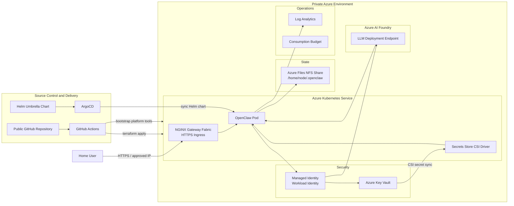

# OpenClaw — Personal AI Assistant

A self-hosted personal AI assistant running on Azure Kubernetes Service, backed by Azure AI Foundry, and accessible from anywhere over HTTPS.

For full details see [PRODUCT.md](PRODUCT.md) and [ARCHITECTURE.md](ARCHITECTURE.md).

## What It Is

OpenClaw is an autonomous AI agent that connects to your messaging platforms, takes actions on your behalf, and works in the background. It runs entirely in your own Azure environment — your data stays under your control.

## Key Design Decisions

- **Application:** Pre-built container image from `ghcr.io/openclaw/openclaw`, pinned to an explicit version tag
- **Infrastructure:** Terraform + Azure Verified Modules (AVM)
- **Runtime:** Azure Kubernetes Service (AKS), free tier, 2 × `Standard_B2s` nodes
- **Application delivery:** GitOps via ArgoCD + Helm (serhanekicii/openclaw-helm)
- **LLM backend:** Azure AI Foundry (Grok models via Azure AI Model Inference)
- **Secrets:** Azure Key Vault; injected at runtime via Secrets Store CSI Driver — nothing in source control
- **Access control:** HTTPS ingress restricted to the user's home public IP; gateway token authentication
- **Identity:** Workload Identity (OIDC federation) — no static credentials in pods
- **Persistent state:** Azure Files NFS share mounted at `/home/node/.openclaw`

## Architecture Diagram

## How It Works

1. A PR is opened with a Terraform or Helm values change.
2. CI applies Terraform to provision or update Azure resources, then runs the platform bootstrap script to install/upgrade cluster tools (Secrets Store CSI Driver, NGINX Gateway Fabric, cert-manager, ArgoCD).
3. ArgoCD detects the updated chart in Git and syncs the OpenClaw Helm release.
4. The Secrets Store CSI Driver syncs Key Vault secrets into the pod at startup.
5. The NFS Azure Files share is mounted, restoring all persistent state.
6. OpenClaw starts and is immediately functional — AI Foundry connected, gateway auth enforced.
7. The user accesses the assistant over HTTPS from their approved IP.

## First-Time Setup

1. Set the `TF_VAR_OPENCLAW_IMAGE_TAG` GitHub Environment variable (e.g. `2026.2.26`).
2. Open a PR — CI applies Terraform to dev and bootstraps the AKS platform.
3. ArgoCD syncs the OpenClaw Helm chart.
4. Run `openclaw doctor` to confirm the assistant is healthy.

No manual Key Vault provisioning or config seeding required — Terraform and Helm handle it.

## Image Upgrades

Update `TF_VAR_OPENCLAW_IMAGE_TAG` in the GitHub Environment variable and open a PR. The plan will show only the image tag change. Merge to apply. Rollback by reverting the variable.

## Security

- No secrets in source control — all in Azure Key Vault
- Workload Identity (OIDC) for pod-to-Azure authentication; no static credentials
- HTTPS ingress with IP allowlist and gateway token authentication
- Terraform is the authoritative source of truth for all Azure resources
- Azure deployment identifiers (tenant, subscription, DNS names) are treated as secret operational metadata and are not documented here

## Further Reading

- [PRODUCT.md](PRODUCT.md) — what the assistant does and how to use it
- [ARCHITECTURE.md](ARCHITECTURE.md) — full technical reference: infrastructure, security model, resource inventory, end-to-end flow
- [CONTRIBUTING.md](CONTRIBUTING.md) — how to make changes safely
- [docs/openclaw-containerapp-operations.md](docs/openclaw-containerapp-operations.md) — operational runbook
