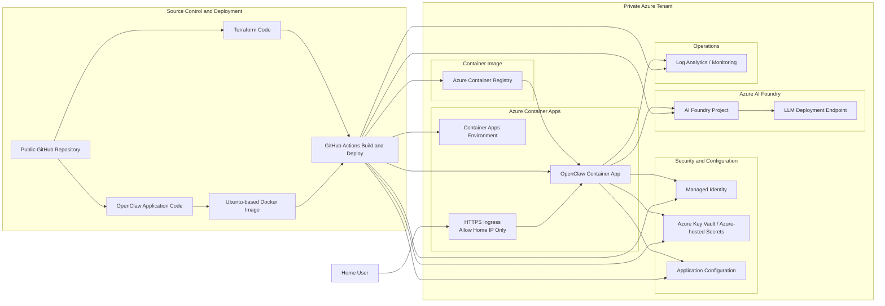

# OpenClaw on Azure Container Apps Architecture

## Overview

This architecture deploys **OpenClaw** from a **public GitHub repository** into **Azure Container Apps** within a private Azure tenant. The application runs in a Docker container based on Ubuntu, with Azure infrastructure provisioned through **Terraform**. Access to the OpenClaw web interface is restricted to the user’s **home public IP address**. Azure AI Foundry provides the **LLM backend**.

## Key Design Decisions

- **Source control:** Public GitHub repository
- **Application packaging:** Docker container based on Ubuntu
- **Infrastructure as Code:** Terraform
- **Hosting platform:** Azure Container Apps
- **LLM backend:** Azure AI Foundry
- **Secrets handling:** No secrets stored in source code or committed to GitHub
- **Access control:** Ingress restricted to the user’s home public IP
- **Authentication to Azure services:** Managed Identity preferred where supported

## Architecture Diagram

## Component Description

### Public GitHub Repository

The public GitHub repository stores:

- OpenClaw application code
- Dockerfile used to build the runtime image
- Terraform code used to provision Azure infrastructure
- GitHub Actions workflows for build and deployment

Because the repository is public, no secrets are stored in code, workflow files, or Terraform variables committed to source control.

### GitHub Actions

GitHub Actions performs the CI/CD workflow:

- Builds the Ubuntu-based Docker image for OpenClaw
- Pushes the container image to Azure Container Registry
- Applies Terraform to provision or update Azure resources
- Deploys the container image to Azure Container Apps

### Azure Container Registry

Azure Container Registry stores the built OpenClaw container image and serves as the image source for Azure Container Apps.

### Azure Container Apps

Azure Container Apps hosts the OpenClaw application and provides:

- Managed container hosting
- HTTPS ingress
- Simplified scaling and runtime management
- Direct connectivity to Azure-native services

### IP-Restricted HTTPS Ingress

The application is exposed through HTTPS ingress, but access is restricted so that only the user’s home public IP address can reach the OpenClaw interface.

This reduces exposure while still allowing the app to be hosted on a public endpoint.

### Managed Identity

Managed Identity is used by the OpenClaw container to authenticate to supported Azure services without embedding credentials in the application.

### Azure Key Vault / Azure-hosted Secrets

Secrets and sensitive configuration values are stored outside the codebase. These may include:

- API keys, if needed
- Service configuration values
- Other deployment secrets not supported through managed identity alone

### Application Configuration

Non-secret application settings are stored separately from code and injected into the container at runtime.

### Azure AI Foundry

Azure AI Foundry provides the LLM backend used by OpenClaw. The application sends prompts and receives model responses from the configured LLM deployment endpoint.

### Log Analytics / Monitoring

Operational logs and telemetry are sent to Azure monitoring services for troubleshooting and visibility.

## End-to-End Flow

1. The user updates code, Docker configuration, or Terraform in the public GitHub repository.
2. GitHub Actions builds the Ubuntu-based OpenClaw container image.
3. GitHub Actions pushes the image to Azure Container Registry.
4. GitHub Actions applies Terraform to provision or update Azure resources in the private Azure environment.
5. Azure Container Apps pulls the image from Azure Container Registry and runs the OpenClaw container.
6. The user accesses OpenClaw over HTTPS from the approved home public IP address.
7. OpenClaw authenticates to Azure services using Managed Identity where possible.
8. OpenClaw connects to Azure AI Foundry to use the configured LLM deployment.
9. Logs and diagnostics are sent to Azure monitoring services.

## Security Principles

- No secrets stored in the public GitHub repository
- Secrets stored in Azure-managed secret services
- Managed Identity used instead of embedded credentials where possible
- Public ingress restricted to a single approved source IP
- HTTPS enabled for encrypted access
- Infrastructure deployed consistently through Terraform
- Azure identifiers such as tenant names, subscription names or IDs, Entra object names, and DNS names are treated as secret deployment metadata and should not be documented in public project files

## Recommended Next-Step Enhancements

- Add a custom domain for the Container App
- Add Azure-managed TLS certificate for the custom domain
- Add basic authentication or federated authentication in front of OpenClaw
- Add separate dev and prod environments if the solution expands
- Add image scanning in the CI pipeline
- Add diagnostic alerts for availability and failed requests

## Assumptions

- The OpenClaw container can run successfully in Azure Container Apps
- Azure AI Foundry is the selected LLM platform
- The user has a stable home public IP or can update ingress rules when the IP changes
- Terraform will be the authoritative deployment mechanism for Azure resources