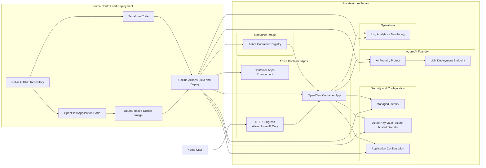

# OpenClaw on Azure Container Apps Architecture

## Overview

This architecture deploys **OpenClaw** from the **pre-built public image** at `ghcr.io/openclaw/openclaw` into **Azure Container Apps** within a private Azure tenant. Infrastructure is provisioned through **Terraform**. Access to the OpenClaw web interface is restricted to the user's **home public IP address**. Azure AI Foundry provides the **LLM backend**. All persistent OpenClaw state is stored on an **Azure Files share** and survives restarts and revision deployments.

## Key Design Decisions

- **Application packaging:** Pre-built container image from `ghcr.io/openclaw/openclaw`, pinned to an explicit version tag
- **Infrastructure as Code:** Terraform
- **Hosting platform:** Azure Container Apps
- **LLM backend:** Azure AI Foundry
- **Secrets handling:** No secrets stored in source code or committed to GitHub; gateway token in Azure Key Vault
- **Access control:** Ingress restricted to the user's home public IP
- **Authentication to Azure services:** Managed Identity preferred where supported
- **State persistence:** Azure Files share mounted at `/home/node/.openclaw`

## Architecture Diagram

## Component Description

### Public GitHub Repository

The public GitHub repository stores:

- Terraform code used to provision Azure infrastructure
- GitHub Actions workflows for deployment

Because the repository is public, no secrets are stored in code, workflow files, or Terraform variables committed to source control.

### GitHub Actions

GitHub Actions performs the CI/CD workflow:

- Applies Terraform to provision or update Azure resources
- Deploys updated configuration to Azure Container Apps via Terraform

### Azure Container Apps

Azure Container Apps hosts the OpenClaw application and provides:

- Managed container hosting with liveness (`/healthz`) and readiness (`/readyz`) probes
- HTTPS ingress
- Simplified scaling and runtime management
- Direct connectivity to Azure-native services

The Container App pulls the pre-built OpenClaw image from `ghcr.io/openclaw/openclaw` at the pinned tag defined by the `openclaw_image_tag` Terraform variable.

### IP-Restricted HTTPS Ingress

The application is exposed through HTTPS ingress, but access is restricted so that only the user’s home public IP address can reach the OpenClaw interface.

This reduces exposure while still allowing the app to be hosted on a public endpoint.

### Managed Identity

Managed Identity is used by the OpenClaw container to authenticate to supported Azure services without embedding credentials in the application.

### Azure Key Vault / Azure-hosted Secrets

Secrets and sensitive configuration values are stored outside the codebase. Current secrets:

- `openclaw-gateway-token`: the gateway authentication token, read by the Container App at startup via Managed Identity

### Azure Files Persistent Storage

An Azure Files share is mounted at `/home/node/.openclaw` inside the OpenClaw container. All OpenClaw state (gateway config, auth profiles, skills state, workspace files, logs) is written here and persists across container restarts and revision deployments.

See [`docs/openclaw-containerapp-operations.md`](docs/openclaw-containerapp-operations.md) for bootstrap, backup/restore, and upgrade procedures.

### Azure AI Foundry

Azure AI Foundry provides the LLM backend used by OpenClaw. The application sends prompts and receives model responses from the configured LLM deployment endpoint.

### Log Analytics / Monitoring

Operational logs and telemetry are sent to Azure monitoring services for troubleshooting and visibility.

## End-to-End Flow

1. The user updates Terraform (or bumps the pinned image tag variable) in the public GitHub repository.
2. GitHub Actions applies Terraform to provision or update Azure resources in the private Azure environment.
3. Azure Container Apps pulls the pre-built OpenClaw image at the pinned tag and starts the container.
4. The Azure Files share is mounted, restoring all persistent OpenClaw state.
5. The Container App reads the `openclaw-gateway-token` Key Vault secret via Managed Identity and starts the gateway with token authentication.
6. The user accesses OpenClaw over HTTPS from the approved home public IP address.
7. OpenClaw authenticates to Azure services using Managed Identity where possible.
8. OpenClaw connects to Azure AI Foundry to use the configured LLM deployment.
9. Logs and diagnostics are sent to Azure monitoring services.

## Deployment Summary

### Required secrets (provision in Key Vault before enabling token injection)

| Secret | Description |
|--------|-------------|
| `openclaw-gateway-token` | Gateway authentication token. Generate a strong random token and store it in the environment Key Vault. Required only when `TF_VAR_OPENCLAW_GATEWAY_TOKEN_ENABLED=true`. |

### GitHub Environment variables to set

| Variable | Example |
|----------|---------|
| `TF_VAR_OPENCLAW_IMAGE_TAG` | `2026.2.26` |
| `TF_VAR_OPENCLAW_GATEWAY_TOKEN_ENABLED` | `true` (set after KV secret is provisioned) |

### First-time bootstrap (two phases)

**Phase 1 — initial deploy (no KV secret required):**
1. Open a PR — CI will plan and apply to dev with `TF_VAR_OPENCLAW_GATEWAY_TOKEN_ENABLED=false` (default).
2. Pre-seed `/home/node/.openclaw/openclaw.json` on the Azure Files share using the bootstrap procedure in [`docs/openclaw-containerapp-operations.md`](docs/openclaw-containerapp-operations.md).

**Phase 2 — activate gateway token auth:**
1. Provision `openclaw-gateway-token` in Key Vault (see runbook section 1.1).
2. Set `TF_VAR_OPENCLAW_GATEWAY_TOKEN_ENABLED=true` in the GitHub Environment variable.
3. Apply Terraform (open a PR or merge) — the Container App is updated to inject the token at startup.

### Image upgrades

Update `TF_VAR_OPENCLAW_IMAGE_TAG` in the GitHub Environment variable and open a PR. The plan will show only the image tag change. Merge to apply. Rollback by reverting the variable value.

## Security Principles

- No secrets stored in the public GitHub repository
- Secrets stored in Azure-managed secret services
- Managed Identity used instead of embedded credentials where possible
- Public ingress restricted to a single approved source IP
- HTTPS enabled for encrypted access
- Infrastructure deployed consistently through Terraform
- Azure identifiers such as tenant names, subscription names or IDs, Entra object names, and DNS names are treated as secret deployment metadata and should not be documented in public project files

## Recommended Next-Step Enhancements

- Add a custom domain for the Container App
- Add Azure-managed TLS certificate for the custom domain
- Add basic authentication or federated authentication in front of OpenClaw
- Add separate dev and prod environments if the solution expands
- Add image scanning in the CI pipeline
- Add diagnostic alerts for availability and failed requests

## Assumptions

- The OpenClaw container can run successfully in Azure Container Apps
- Azure AI Foundry is the selected LLM platform
- The user has a stable home public IP or can update ingress rules when the IP changes
- Terraform will be the authoritative deployment mechanism for Azure resources