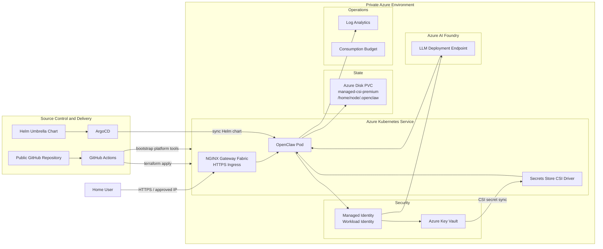

# OpenClaw — Personal AI Assistant

A self-hosted personal AI assistant running on Azure Kubernetes Service, backed by Azure AI Foundry, and accessible from anywhere over HTTPS.

For full details see [PRODUCT.md](PRODUCT.md) and [ARCHITECTURE.md](ARCHITECTURE.md).

## What It Is

OpenClaw is an autonomous AI agent that connects to your messaging platforms, takes actions on your behalf, and works in the background. It runs entirely in your own Azure environment — your data stays under your control.

## Key Design Decisions

- **Application:** Pre-built container image from `ghcr.io/openclaw/openclaw`, pinned to an explicit version tag
- **Infrastructure:** Terraform + Azure Verified Modules (AVM)
- **Runtime:** Azure Kubernetes Service (AKS), free tier, 2 × `Standard_B2s` nodes
- **Application delivery:** GitOps via ArgoCD + Helm (serhanekicii/openclaw-helm)
- **LLM backend:** Azure AI Foundry (Grok models via Azure AI Model Inference)
- **Secrets:** Azure Key Vault; injected at runtime via Secrets Store CSI Driver — nothing in source control
- **Access control:** HTTPS ingress restricted to the user's home public IP; gateway token authentication
- **Identity:** Workload Identity (OIDC federation) — no static credentials in pods
- **Persistent state:** Azure Disk volume (Premium SSD PVC, `managed-csi-premium`, 10 Gi, ReadWriteOnce) mounted at `/home/node/.openclaw`

## Architecture Diagram


```mermaid
flowchart LR
    subgraph DEV[Source Control and Delivery]
        GH[Public GitHub Repository]
        CI[GitHub Actions]
        ARGOCD[ArgoCD]
        HELM[Helm Umbrella Chart]
    end

    subgraph AZ[Private Azure Environment]
        subgraph AKS[Azure Kubernetes Service]
            GW[NGINX Gateway Fabric\nHTTPS Ingress]
            OC[OpenClaw Pod]
            CSI[Secrets Store CSI Driver]
        end

        subgraph SEC[Security]
            MI[Managed Identity\nWorkload Identity]
            KV[Azure Key Vault]
        end

        subgraph STORAGE[State]
            DISK[Azure Disk PVC\nmanaged-csi-premium\n/home/node/.openclaw]
        end

        subgraph AI[Azure AI Foundry]
            LLM[LLM Deployment Endpoint]
        end

        subgraph OPS[Operations]
            LOG[Log Analytics]
            BUDGET[Consumption Budget]
        end
    end

    USER[Home User] -->|HTTPS / approved IP| GW
    GW --> OC

    GH --> CI
    CI -->|terraform apply| AKS
    CI -->|bootstrap platform tools| AKS
    ARGOCD -->|sync Helm chart| OC
    HELM --> ARGOCD

    KV -->|CSI secret sync| CSI
    CSI --> OC
    OC --> MI
    MI --> KV
    MI --> LLM
    OC --> DISK
    OC --> LOG
    LLM --> OC
```

## How It Works

1. A PR is opened with a Terraform or Helm values change.
2. CI applies Terraform to provision or update Azure resources, then runs the platform bootstrap script to install/upgrade cluster tools (Secrets Store CSI Driver, NGINX Gateway Fabric, cert-manager, ArgoCD).
3. ArgoCD detects the updated chart in Git and syncs the OpenClaw Helm release.
4. The Secrets Store CSI Driver syncs Key Vault secrets into the pod at startup.
5. The dynamically provisioned Azure Disk PVC (`managed-csi-premium`) is mounted at `/home/node/.openclaw`, restoring all persistent state.
6. OpenClaw starts and is immediately functional — AI Foundry connected, gateway auth enforced.
7. The user accesses the assistant over HTTPS from their approved IP.

## First-Time Setup

1. Set the `TF_VAR_OPENCLAW_IMAGE_TAG` GitHub Environment variable (e.g. `2026.2.26`).
2. Open a PR — CI applies Terraform to dev and bootstraps the AKS platform.
3. ArgoCD syncs the OpenClaw Helm chart.
4. Run `openclaw doctor` to confirm the assistant is healthy.

No manual Key Vault provisioning or config seeding required — Terraform and Helm handle it.

## Image Upgrades

Update `TF_VAR_OPENCLAW_IMAGE_TAG` in the GitHub Environment variable and open a PR. The plan will show only the image tag change. Merge to apply. Rollback by reverting the variable.

## Security

- No secrets in source control — all in Azure Key Vault
- Workload Identity (OIDC) for pod-to-Azure authentication; no static credentials
- HTTPS ingress with IP allowlist and gateway token authentication
- Terraform is the authoritative source of truth for all Azure resources
- Azure deployment identifiers (tenant, subscription, DNS names) are treated as secret operational metadata and are not documented here

## Dev Environment Schedule

The dev AKS cluster stops automatically each night to reduce compute costs. It does **not** start automatically — it must be started manually before any dev work and will remain stopped indefinitely unless explicitly started.

| Event | Time | Days |
|---|---|---|
| Cluster stop | 02:00 Mountain Time (America/Denver) | Daily |
| Cluster start | Manual only | — |

The stop schedule honours daylight saving time automatically via the `America/Denver` IANA timezone ID.

**To start or stop the cluster manually:**

```bash
# Check current state first — output will be "Stopped" or "Running"
az aks show --resource-group <dev-resource-group> --name <dev-cluster-name> --query powerState.code

# Start (blocks until Running, ~3–5 min)
az aks start --resource-group <dev-resource-group> --name <dev-cluster-name>

# Stop
az aks stop --resource-group <dev-resource-group> --name <dev-cluster-name>
```

Alternatively, navigate to the Azure Portal → Automation Account → Runbooks and trigger `*-start-cluster` or `*-stop-cluster` manually.

### Troubleshooting: Cluster Stopped

If `kubectl` commands time out or the OpenClaw gateway is unreachable, the cluster is likely stopped. Follow these steps in order:

**Step 1 — Confirm the cluster is stopped**
```bash
az aks show --resource-group <dev-rg> --name <dev-cluster> --query powerState.code
```
Expected: `"Stopped"`. If `"Running"`, skip to Step 3.

**Step 2 — Start the cluster**

Option A — CLI (blocks until Running, ~3–5 min):
```bash
az aks start --resource-group <dev-rg> --name <dev-cluster>
```
Option B — Portal: Automation Account → Runbooks → `*-start-cluster` → Start → OK.

Confirm running before continuing:
```bash
az aks show --resource-group <dev-rg> --name <dev-cluster> --query powerState.code
# expected: "Running"
```

**Step 3 — Refresh kubeconfig**

The kubeconfig token may be stale after a stop/start cycle:
```bash
az aks get-credentials --resource-group <dev-rg> --name <dev-cluster> --overwrite-existing
```

**Step 4 — Wait for system pods**

CoreDNS, CSI driver, cert-manager, ArgoCD, and NGINX Gateway take ~2–3 min to become Ready after nodes are up:
```bash
kubectl get pods -A --field-selector=status.phase!=Running
```
Re-run until output is empty.

**Step 5 — Check ArgoCD sync state**
```bash
kubectl get applications -n argocd
```
If any application shows `OutOfSync`, trigger a sync:
```bash
kubectl -n argocd patch application <app-name> --type merge -p '{"operation":{"sync":{"revision":"HEAD"}}}'
```
Or use the ArgoCD UI via port-forward:
```bash
kubectl port-forward svc/argocd-server -n argocd 8080:80
# then open http://localhost:8080
```

**Step 6 — Verify OpenClaw pods**
```bash
kubectl get pods -A -l app.kubernetes.io/name=openclaw
```
All pods should show `Running 1/1`. If a pod is in `CrashLoopBackOff` or `Pending`, check:
```bash
kubectl describe pod -n openclaw-<inst> <pod-name>
```
Common cause: CSI secret sync delay. Wait 60 s and re-check. If still failing:
```bash
kubectl rollout restart deployment/openclaw -n openclaw-<inst>
```

**Step 7 — Reconnect the local CLI and verify**
```bash
source <(./scripts/openclaw-connect.sh dev --export)
openclaw status --all
openclaw doctor
```

**Dev desktop Windows VM:** The dev desktop VM is not managed by Terraform. To align its shutdown with the cluster stop, configure a Windows Task Scheduler task manually:

1. Open Task Scheduler → Create Basic Task.
2. Trigger: Daily at 02:00.
3. Action: Start a Program → `shutdown.exe` with arguments `/s /t 60 /c "Nightly scheduled shutdown"`.
4. Set "Run whether user is logged on or not."

This is a one-time manual step. If the VM is reimaged, the task must be reconfigured.

## Further Reading

- [PRODUCT.md](PRODUCT.md) — what the assistant does and how to use it
- [ARCHITECTURE.md](ARCHITECTURE.md) — full technical reference: infrastructure, security model, resource inventory, end-to-end flow
- [CONTRIBUTING.md](CONTRIBUTING.md) — how to make changes safely
- [docs/openclaw-operations.md](docs/openclaw-operations.md) — operational runbook
